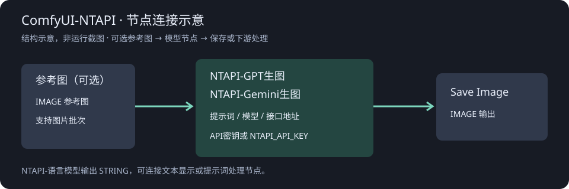

# ComfyUI-NTAPI

在 ComfyUI 中调用 NTAPI 的语言、GPT 图片与 Gemini 图片接口，并提供视频兼容节点。中文参数、参考图输入，可自定义模型与接入地址。

**状态：`0.2.0a1` 本地预览版。** 已通过本地模拟测试；尚未用真实 NTAPI 密钥验证生产调用。视频接口使用兼容协议，服务端支持情况未确认，详见 [视频说明](docs/VIDEO.md)。模型下拉框是公开模型目录的快照，不代表账户拥有权限或接口已可用。本插件并非 NTAPI 官方产品。



## 节点与接口

| 节点 | 功能 | 路径 | 输出 |
| --- | --- | --- | --- |
| NTAPI-语言模型 | 文字与参考图理解 | `/v1/chat/completions` | STRING |
| NTAPI-GPT生图 | 文生图、参考图编辑 | `/v1/images/generations` / `/v1/images/edits` | IMAGE |
| NTAPI-Gemini生图 | Gemini 原生生图 | `/v1beta/models/{model}:generateContent` | IMAGE、结果格式 |
| NTAPI-视频生成（兼容模式） | 文生、图生、首尾帧、多参考图 | `/v1/videos` | 任务ID |
| NTAPI-视频编辑（兼容模式） | 原生 VIDEO 上传或视频 URL 编辑 | `/v1/videos` | 任务ID |
| NTAPI-视频任务获取 | 轮询、下载、续取结果 | `/v1/videos/{id}` | VIDEO、视频URL |
| NTAPI-Seedance 2.0生成（兼容模式） | 文生、首尾帧、多模态，自动等待下载 | `/v1/videos` | VIDEO、视频URL |
| NTAPI-Seedance 2.5生成（兼容模式） | t2v、i2v、multi，自动等待下载 | `/v1/videos` | VIDEO、视频URL |
| NTAPI-Seedance 2.0任务获取 | 旧任务恢复查询与下载 | `/v1/videos/{id}` | VIDEO、视频URL |

GPT 和 Gemini 生图均使用 ComfyUI 原生自动扩展输入：初始显示 1 个参考图接口，连接后补出下一个空接口，最多 14 个；不接参考图仍可文生图。旧工作流的参考图连线会迁移。需要支持 Autogrow 的新版 ComfyUI；不支持新版 API 的旧环境保留原来的固定输入布局。语言节点仍为 4 个插槽。每个插槽的 IMAGE 批次会逐张发送，不截断批次。参考图按原尺寸编码为 RGB JPEG（质量 100），透明通道不会传递。上游图片数量限制以服务为准。

## 安装

环境需要 ComfyUI、Python 3.10+ 和 ComfyUI 已安装的 PyTorch。本插件不更改 CUDA/PyTorch 环境。

1. 下载本仓库源码，将包含 `__init__.py` 的目录命名为 `ComfyUI-NTAPI`，放入 `ComfyUI/custom_nodes/`，避免多套一层目录。
2. 在本插件目录，使用 **ComfyUI 所使用的 Python 环境**执行 `python -m pip install -r requirements.txt`。
3. 重启 ComfyUI，双击画布搜索 `NTAPI`，节点分类为 `NTAPI中转`。

也可以在 `ComfyUI/custom_nodes/` 目录克隆安装：

```text
git clone https://github.com/nantian555/ComfyUI-NTAPI.git
```

Windows portable 用户也可以在便携版根目录执行：

```powershell
.\python_embeded\python.exe -m pip install -r .\ComfyUI\custom_nodes\ComfyUI-NTAPI\requirements.txt
```

## 密钥和地址

推荐在启动 ComfyUI 的进程环境中设置 `NTAPI_API_KEY`，并将节点的密钥输入留空（GPT/Gemini 生图显示“API秘钥”，其他节点显示“API密钥”）。也支持在节点内填写密钥；显式填写优先于环境变量。

**节点内填写的密钥可能保存在工作流 JSON、历史记录和输出图片的工作流元数据中。** 分享前请清空密钥；已经泄露的密钥应在服务控制台撤销。`.gitignore` 不能自动清除已写入工作流的密钥。本插件不自动读取 `.env` 文件。

语言/GPT 默认接入地址为 `https://ntapi.org/v1`；Gemini 的默认根地址为 `https://ntapi.org`。GPT/Gemini 生图不再显示接口地址控件，需要覆盖时在启动环境设置 `NTAPI_BASE_URL`（例如包含 `/v1` 的接入地址）；其他节点仍在节点中填写地址。首页另有 `https://api.ntapi.org/v1` 示例，请以账户控制台给出的有效地址为准；插件不会自动切换域名。Gemini 会去除地址末尾的 `/v1` 或 `/v1beta` 再构造原生接口路径。

远程携带密钥的请求必须使用 HTTPS；允许 localhost HTTP 用于本地测试。图片下载只对同源地址（协议、主机、端口均相同）发送密钥。请求不跟随重定向；请填写最终接口或图片直链。

“绕过代理”为真时禁用 Requests 的环境代理与 `.netrc` 自动认证（`trust_env=False`）；也不使用 `REQUESTS_CA_BUNDLE` 等环境配置，使用默认 CA 校验。关闭该选项时遵循系统/环境代理设置。TLS 验证始终启用。

## 使用与示例

将 [GPT 文生图工作流](examples/gpt-image.workflow.json) 或 [Gemini 文生图工作流](examples/gemini-image.workflow.json) 拖入 ComfyUI，再设置密钥或启动环境变量。两个工作流均连接原生 `SaveImage`，不包含密钥或生成图片。

- 语言节点：填写用户提示词，可连接参考图，STRING 输出接文本显示或后续处理节点。
- GPT 生图参数顺序：提示词、API秘钥、模型、比例、分辨率、质量、风格、数量、输出格式、返回格式、绕过代理、超时时间、种子、运行后控制。
- GPT 未连接参考图时文生图，连接参考图时使用 multipart 编辑接口。比例支持 auto 和 13 种固定比例，分辨率为 1k/2k/4k；auto 将 size=auto 交给服务决定。固定比例使用像素尺寸映射，例如 16:9/4k 为 3840×2160、1:1/4k 为 2880×2880。
- 质量为 auto/high/medium/low；输出格式为 png/jpeg/webp，控制服务端图像编码；返回格式 url/b64_json 决定传输方式。下载后均输出 RGB IMAGE，最终保存格式由 Save Image 等下游节点决定。
- 风格保留服务默认/vivid/natural。服务默认不发送 style；GPT-image 未必支持风格字段，各模型质量/尺寸能力仍以服务为准。
- 超时时间默认 900 秒，范围 60–1200 秒，应用于生成请求的读取等待和每张结果图片下载；连接等待最多 30 秒，不自动重试。
- 种子用于 ComfyUI 缓存控制，不发给图片 API，不保证相同种子复现。运行后控制采用 ComfyUI 原生 fixed/increment/decrement/randomize（固定/递增/递减/随机）；要重复提交相同提示词可选择随机。
- 原 11 控件的 GPT 示例/工作流加载时会迁移参数位置。旧 standard/服务默认质量映射为 auto；旧 1536×1024 与 1024×1536 分别映射到 3:2/1k 与 2:3/1k，像素尺寸因此改为 1248×832 与 832×1248。旧自定义接口地址需改用 NTAPI_BASE_URL；重新检查模型和参数后运行。
- Gemini 参数顺序：提示词、API秘钥、模型、比例、分辨率、输出格式、绕过代理、超时时间、种子、运行后控制。保留原生 generateContent 接口，去掉不支持的质量、风格、数量、返回格式；每次执行只提交一次，不追加风格提示词或多次请求。
- Gemini “自动”比例表示交由服务决定，分辨率使用 1K/2K/4K。输出格式 png/jpeg/webp 映射到 `generationConfig.imageConfig.imageOutputOptions.mimeType`；该字段按 ComfyUI 原生 Gemini 请求类型使用，NTAPI 与具体模型是否接受仍需实测。种子 0 不发送，正数发送；服务是否支持可复现以模型为准。超时时间用于请求与下载，默认 900 秒。
- Gemini 保留 IMAGE 和“结果格式”STRING 两个输出；后者表示实际上游数据来源（inlineData/url），并非可选的返回格式。旧 9 控件工作流加载时会迁移密钥、比例、分辨率和种子位置；原接口根地址控件改用 NTAPI_BASE_URL。
- 生图返回 URL、Base64 或 Gemini inlineData/fileData；图片批次尺寸不一致时，后续图片缩放至首张尺寸以组成 ComfyUI IMAGE 批次。输出为 RGB，无 MASK/透明通道。

视频用法、协议限制和示例见 [视频节点说明](docs/VIDEO.md)。视频任务获取的 VIDEO 输出可直接连接原生 Save Video。

Seedance 两套接口、动态图片/视频/音频输入及示例见 [Seedance 说明](docs/SEEDANCE.md)。需要支持原生 Autogrow 的新版 ComfyUI。两套 Seedance 均直接输出视频接 Save Video；无需另接获取节点。模型与接口尚未在 NTAPI 实测。所有动态参考接口去除重复分组前缀，仅显示参考图1、参考视频1、参考音频1等标签，内部连线标识不变。

NTAPI 将 Seedance 以 `Svideo` 品牌和模型 ID 对外展示。节点界面保留 Seedance 参考名称，提交时自动映射为对应的 `Svideo-2.0-*` 或 `Svideo-2.5-*` ID。节点不额外读取模型列表；自定义模型按填写内容原样发送。

Seedance/Svideo 对官方 `ntapi.org` 地址会自动使用 API 专用域名 `api.ntapi.org`，避免网页域名的长请求连接被中断。自定义域名不会自动改写。

## 错误与限制

- HTTP 错误、非 JSON、空图片、解码失败和超时会使节点明确报错，避免把失败当作有效图片/文本继续执行。
- 不输出密钥、提示词或上游原始错误正文；HTTP 状态保留在错误消息中，详细原因请在 NTAPI 控制台查看。
- 图片与语言节点只处理同步结果；通用视频节点分离提交和查询，Seedance 节点则内部完成提交、等待和下载。超时不表示服务端未受理，请检查任务后再决定重跑，以免重复计费。
- 不包含后台任务队列、遥测或启动时联网检查。只有执行节点时才发送请求；参考图片/视频会上传到配置的服务。
- 同一输入可能被 ComfyUI 缓存；需要新结果时修改实际参数/提示词，或按 ComfyUI 的缓存设置操作。

## 测试

在本目录使用 ComfyUI 的 Python 执行：

```text
python -m unittest discover -s tests -v
node tests/test_gpt_image_ui.mjs
```

测试使用 mock 和本地 HTTP 服务，覆盖 JSON/multipart、批次、鉴权、代理、HTTP/超时/坏响应、图片下载和密钥隐藏，不需要真实密钥，不产生模型费用。GitHub Actions 提供 Linux Python 3.10/3.13 测试，云端结果见 [Actions](https://github.com/nantian555/ComfyUI-NTAPI/actions)。

## 发布

发布前查看 [发布说明与检查步骤](docs/RELEASING.md) 和 [更新记录](CHANGELOG.md)。当前建议作为 Pre-release 发布，并保留“生产接口尚未验证”的说明。GitHub 发布不等于 ComfyUI Registry/Manager 上架。

## 许可证

[MIT License](LICENSE)，版权和来源声明见 [NOTICE.md](NOTICE.md)。接口依据：[NTAPI 模型广场](https://ntapi.org/pricing)、[New API 图片接口](https://docs.newapi.pro/zh/docs/api/ai-model/images/openai/post-v1-images-generations)、[Gemini 原生图片接口](https://docs.newapi.pro/zh/docs/api/ai-model/images/gemini/geminirelayv1beta-383837589)（2026-10-05 查阅）。
